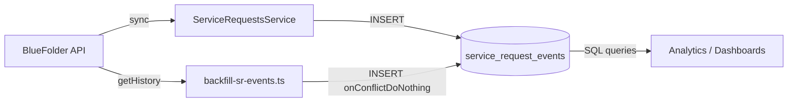
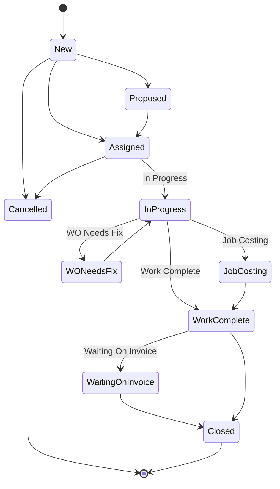
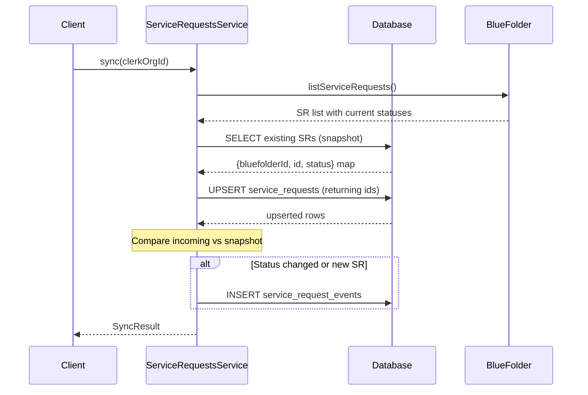
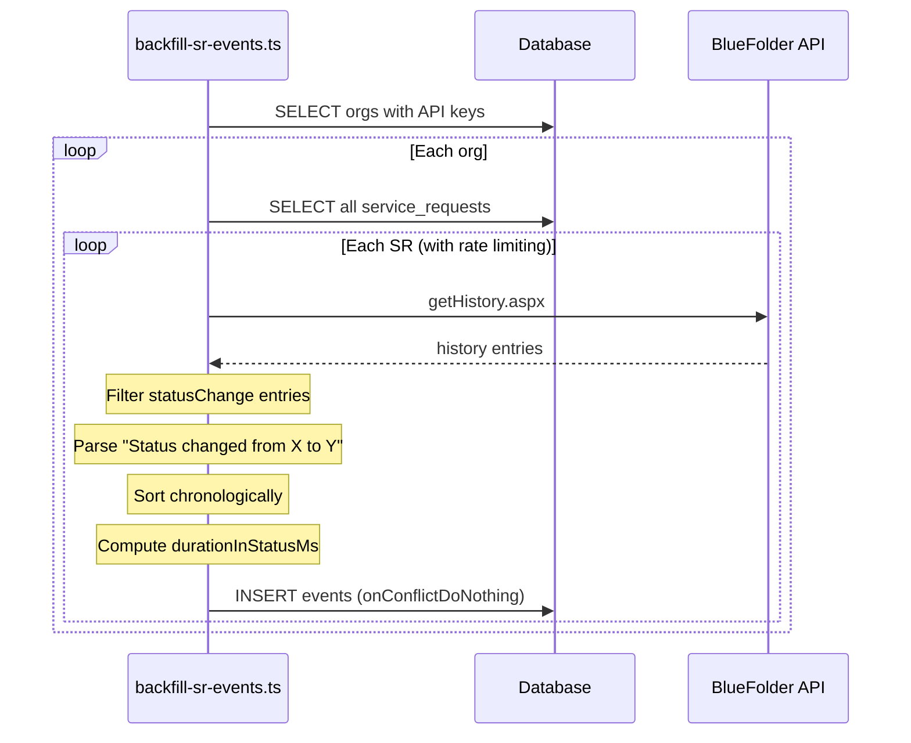

# Service Request Event Tracking

Immutable event log capturing every status transition on service requests. Enables time-in-status analytics, PM performance benchmarking, and future human-vs-agent comparison.

## Architecture



**Two data paths:**
- **Ongoing capture**: `sync()` detects status changes by comparing incoming data against a snapshot of existing SR statuses. Fires on every sync (manual or cron).
- **Historical backfill**: CLI script fetches full history from BlueFolder's `getHistory.aspx` endpoint, parses status change entries, and bulk inserts with deduplication.

## Table Schema

| Column | Type | Nullable | Default | Notes |
|--------|------|----------|---------|-------|
| `id` | uuid | no | `gen_random_uuid()` | PK |
| `organization_id` | uuid FK | no | - | Org scoping |
| `service_request_id` | uuid FK | no | - | Parent SR |
| `from_status` | text | yes | - | null for first event |
| `to_status` | text | no | - | New status |
| `occurred_at` | timestamptz | no | - | When transition happened (BF timestamp) |
| `duration_in_status_ms` | bigint | yes | - | Pre-computed ms in previous status |
| `source` | text | yes | - | `'bluefolder'`, `'agent'` later |
| `bluefolder_history_id` | integer | yes | - | For backfill dedup |
| `created_at` | timestamptz | no | `now()` | Row insert time |

**Constraints:**
- `uq_sr_event_bf_history` UNIQUE on `(service_request_id, bluefolder_history_id)` - prevents duplicate backfill imports

## Status Lifecycle



## Ongoing Capture (sync)



**Key behaviors:**
- New SRs get a creation event (`from_status = null`)
- `duration_in_status_ms` is null for ongoing events (computed retroactively or via backfill)
- `occurred_at` uses the sync timestamp (not BF timestamp, since we detect at sync time)

## Backfill Process



**Rate limiting:** 800ms between API calls (~75 req/min, under BF's 100/min limit). On 429 errors, respects `Retry-After` header.

**Idempotent:** Uses `onConflictDoNothing` on `(service_request_id, bluefolder_history_id)` unique constraint. Safe to re-run.

## Commands

```bash
# Generate migration
cd apps/api && bunx --bun drizzle-kit generate

# Apply migration
bunx --bun drizzle-kit push

# Backfill all orgs
bun run db:backfill-events

# Backfill specific org
bun run db:backfill-events org_abc123
```

## Example Analytics Queries

### Time-to-close by SR

```sql
SELECT
  sr.bluefolder_id,
  sr.description,
  EXTRACT(EPOCH FROM (sr.date_time_closed - sr.date_time_created)) / 3600 AS hours_to_close
FROM service_requests sr
WHERE sr.date_time_closed IS NOT NULL
ORDER BY hours_to_close DESC
LIMIT 20;
```

### Average time in each status

```sql
SELECT
  to_status AS status,
  COUNT(*) AS transitions,
  AVG(duration_in_status_ms) / 3600000.0 AS avg_hours,
  PERCENTILE_CONT(0.5) WITHIN GROUP (ORDER BY duration_in_status_ms) / 3600000.0 AS median_hours,
  PERCENTILE_CONT(0.95) WITHIN GROUP (ORDER BY duration_in_status_ms) / 3600000.0 AS p95_hours
FROM service_request_events
WHERE duration_in_status_ms IS NOT NULL
GROUP BY to_status
ORDER BY avg_hours DESC;
```

### Bottleneck detection (longest status dwell)

```sql
SELECT
  sr.bluefolder_id,
  sr.description,
  e.from_status,
  e.to_status,
  e.duration_in_status_ms / 3600000.0 AS hours_in_status,
  e.occurred_at
FROM service_request_events e
JOIN service_requests sr ON sr.id = e.service_request_id
WHERE e.duration_in_status_ms IS NOT NULL
ORDER BY e.duration_in_status_ms DESC
LIMIT 20;
```

### Human vs Agent comparison (template)

```sql
SELECT
  e.source,
  e.to_status,
  COUNT(*) AS transitions,
  AVG(e.duration_in_status_ms) / 3600000.0 AS avg_hours
FROM service_request_events e
WHERE e.duration_in_status_ms IS NOT NULL
GROUP BY e.source, e.to_status
ORDER BY e.source, e.to_status;
```

## Future Considerations

- **Agent source tracking**: When AI agent automation handles status transitions, set `source = 'agent'` to enable human-vs-agent comparison
- **SLA alerting**: Query events to detect SRs stuck in a status beyond threshold
- **Frontend dashboard**: Time-in-status charts, bottleneck visualization, trend analysis
- **Computed durations for ongoing events**: Backfill `duration_in_status_ms` retroactively for events captured by ongoing sync (using consecutive event timestamps)
