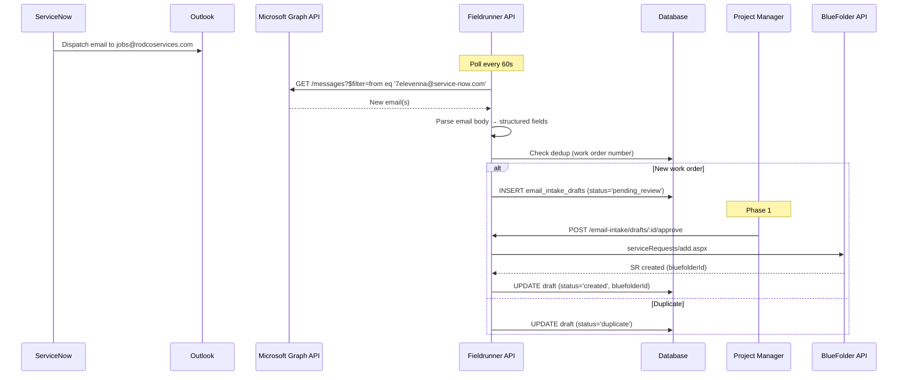
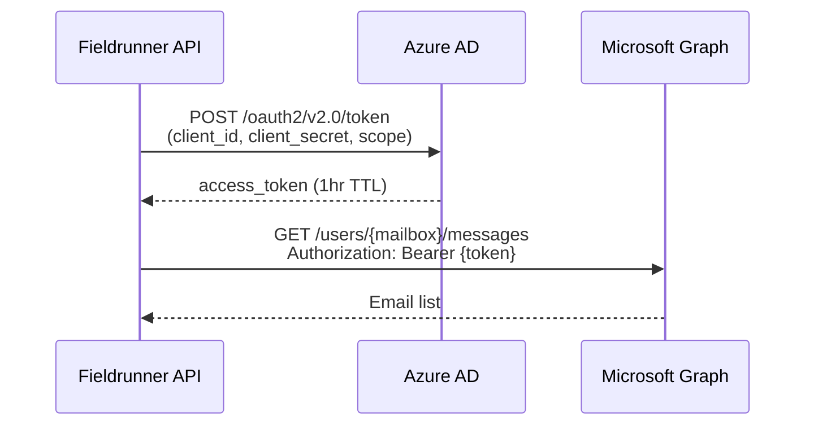
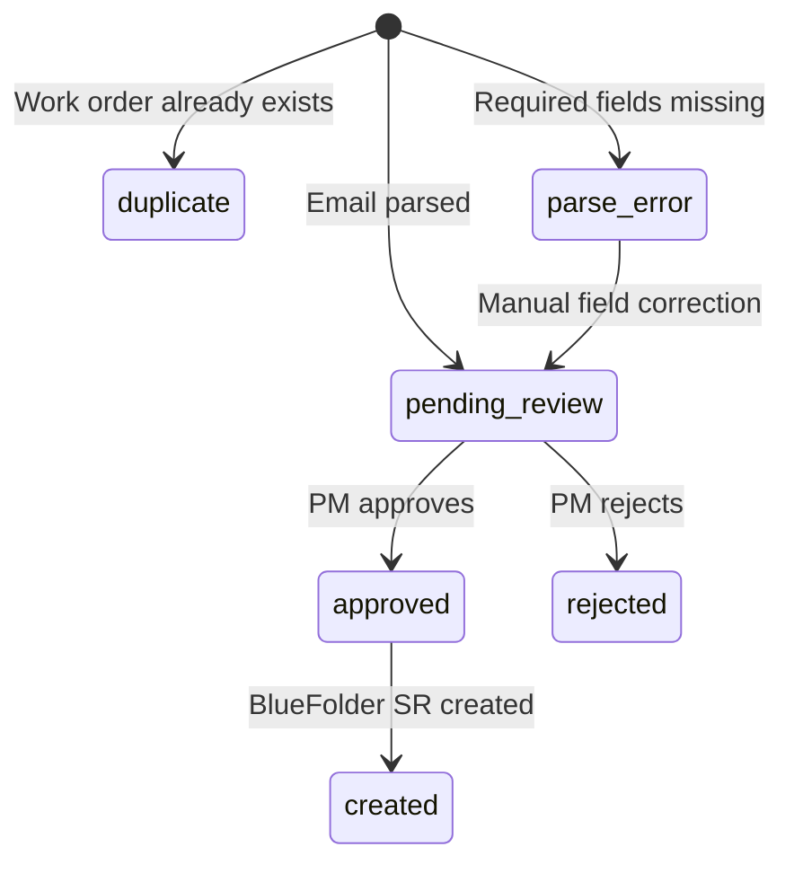
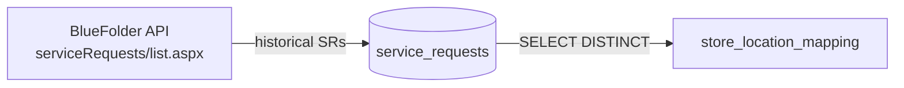

# ServiceNow Email Intake

Automated pipeline that parses 7-Eleven dispatch emails from ServiceNow/Nuvolo and creates BlueFolder service requests — eliminating manual VA data entry and closing the "New → In Progress" timing gap.

## Problem Statement

RodCo's largest client is 7-Eleven, accounting for **66% of all service requests** (791 of ~1,200 SRs). 7-Eleven dispatches work orders through ServiceNow/Nuvolo, which arrive as structured emails to `jobs@rodcoservices.com`. Today, virtual assistants manually read these emails and re-enter the data into BlueFolder.

This creates two problems:

1. **Delayed SR creation.** PMs often start working a job before the VA enters it in BlueFolder, meaning the SR's `dateTimeCreated` reflects when the VA got to it — not when the work was actually dispatched. Event data confirms this: the median "New → In Progress" time is only **1.0 hour**, but that's because SRs are created retroactively after work has already begun.

2. **Data entry errors.** Manual transcription of store numbers, addresses, priority levels, and work order descriptions introduces inconsistencies.

### Evidence from Event Data (Sep 2025 – Mar 2026)

| Metric | Value |
|--------|-------|
| Total SRs analyzed | 1,201 |
| 7-Eleven SRs | 791 (66%) |
| "New" status median dwell | 1.0 hours |
| "New" status p95 dwell | 385.7 hours |
| "New → In Progress" median | 1.4 hours |
| "New → In Progress" p95 | 49.3 hours |

The short median with a massive p95 tail confirms the pattern: most SRs are entered right before (or after) work starts, but outliers sit for days before a VA processes them.

```sql
-- 7-Eleven dominance in SR volume
SELECT customer_name, customer_id, COUNT(*) AS sr_count
FROM service_requests
WHERE organization_id = :orgId
GROUP BY customer_name, customer_id
ORDER BY sr_count DESC
LIMIT 5;

-- Result:
-- Seven Eleven        | 38508963 | 791
-- Cato Corporation    | 38856523 | 309
-- Dick's Sporting Goods | 38913727 | 55
-- Capitol Petroleum   | 38798796 | 45
-- GPM Investments     | 39198564 | 32
```

## Architecture

```mermaid
flowchart LR
    SN[ServiceNow / Nuvolo] -->|dispatch email| OL[Outlook<br>jobs@rodcoservices.com]
    OL -->|Microsoft Graph API| FR[Fieldrunner API<br>EmailIntakeService]
    FR -->|Phase 1| DQ[(Draft Queue<br>email_intake_drafts)]
    DQ -->|PM approves| BF[BlueFolder API<br>serviceRequests/add.aspx]
    FR -->|Phase 2| BF
    BF -->|next sync| DB[(service_requests)]
    DB -->|event| EE[EventEmitter<br>sync.completed]
```

**Two phases:**
- **Phase 1 (Human-in-the-Loop):** Parsed emails land in a draft queue. PMs review and approve before BlueFolder SR creation.
- **Phase 2 (Auto-Creation):** Known store/category combinations skip the queue and create SRs automatically.

### End-to-End Sequence



## Email Template Spec

All 5 sample emails use an **identical template**. Sender is always `7elevenna@service-now.com`. The body is plain-text key-value pairs — not HTML — making regex parsing reliable.

### Sample Email

```
From: 7HELP Service Desk <7elevenna@service-now.com>
To: Rodco Jobs <jobs@rodcoservices.com>
Subject: 7-Eleven Priority 1 - Critical Work Order FWKD11021610 / INC23544260
         has been dispatched.

Work Order FWKD11021610 has been submitted with the following details:

Number: FWKD11021610
Incident: INC23544260

Store Location: 7-ELEVEN STORE - 23655
Store Address: 920 BOULEVARD,SEASIDE HEIGHTS,NJ,US,087512128
AFM: Terry Mcgovern
Email: Terry.McGovern@7-11.com
Priority: 1 - Critical
State: Open
Functional Status: Dispatched

Line of Service: EMS
Business Service: EMS
Category: EMS GENERATED ALARM|EMS
Sub Category: NO COMM HVAC-1
Service Provider: Rodco

Order Summary: STORE COMPLAINT: "Store temp is very very cold at night..."

Order Description: STORE COMPLAINT: "Store temp is very very cold..."
REMOTE FINDINGS: -There's no communication with the RTU1...

Ref:MSG631642386_4OR0HeJ7bbArTKhzL6
```

### Field Reference

| Field | Location | Format | Example |
|-------|----------|--------|---------|
| Work Order Number | Subject + Body (`Number:`) | `FWKD\d{8}` | `FWKD11021610` |
| Incident Number | Subject + Body (`Incident:`) | `INC\d{8}` | `INC23544260` |
| Store Name | Body (`Store Location:`) | `{BRAND} STORE - {number}` | `7-ELEVEN STORE - 23655` |
| Store Number | Parsed from Store Location | `\d{4,5}` after ` - ` | `23655` |
| Store Address | Body (`Store Address:`) | `street,city,state,country,zip` | `920 BOULEVARD,SEASIDE HEIGHTS,NJ,US,087512128` |
| AFM Name | Body (`AFM:`) | Free text | `Terry Mcgovern` |
| AFM Email | Body (`Email:`) | Email address | `Terry.McGovern@7-11.com` |
| Priority | Subject + Body (`Priority:`) | `{1\|2\|3\|4} - {label}` | `1 - Critical` |
| State | Body (`State:`) | Always `Open` | `Open` |
| Functional Status | Body (`Functional Status:`) | Always `Dispatched` | `Dispatched` |
| Line of Service | Body (`Line of Service:`) | Free text | `EMS` |
| Business Service | Body (`Business Service:`) | Free text | `EMS` |
| Category | Body (`Category:`) | Free text, may contain `\|` | `EMS GENERATED ALARM\|EMS` |
| Sub Category | Body (`Sub Category:`) | Free text | `NO COMM HVAC-1` |
| Service Provider | Body (`Service Provider:`) | Should always be `Rodco` | `Rodco` |
| Order Summary | Body (`Order Summary:`) | Free text (single line) | `STORE COMPLAINT: "Store temp..."` |
| Order Description | Body (`Order Description:`) | Free text (multi-line, until `Ref:`) | Full description with remote findings |
| Reference ID | Body (`Ref:`) | `MSG\d+_[A-Za-z0-9]+` | `MSG631642386_4OR0HeJ7bbArTKhzL6` |

### Validated Across Samples

| Sample | Work Order | Priority | Service Type | State |
|--------|-----------|----------|-------------|-------|
| 1 | FWKD11021610 | 1 - Critical | EMS / HVAC | NJ |
| 2 | FWKD11015792 | 2 - Emergency | General Maintenance / Front door | NJ |
| 3 | FWKD11037865 | 1 - Critical | Plumbing / Toilet | NY |
| 4 | FWKD11040661 | 1 - Critical | (body truncated) | NY |
| 5 | FWKD11034665 | 1 - Critical | EMS / HVAC / Ducts | NJ |

Template is **consistent across all priority levels, service types, and geographies**.

## Microsoft Graph Integration

RodCo uses **Microsoft 365 / Exchange Online** (confirmed via SMTP headers showing `outbound.protection.outlook.com`). The `jobs@rodcoservices.com` mailbox is the target.

### Polling vs. Subscriptions

| Approach | Latency | Complexity | Reliability |
|----------|---------|------------|-------------|
| **Polling** (recommended) | 30-60s | Low — simple GET calls | High — no webhook infrastructure needed |
| Change Notifications (webhook) | ~seconds | Medium — requires public HTTPS endpoint, subscription renewal every 3 days | Medium — subscriptions expire, need renewal logic |

**Recommendation: Polling.** The 30-60 second delay is negligible for this use case (current manual process takes hours to days). Polling avoids the complexity of managing webhook subscriptions and doesn't require a publicly-accessible endpoint.

### Auth: Client Credentials Flow



**Auth parameters:**
- Grant type: `client_credentials`
- Scope: `https://graph.microsoft.com/.default`
- Permission: `Mail.Read` (Application, not Delegated)
- Token endpoint: `https://login.microsoftonline.com/{tenantId}/oauth2/v2.0/token`

### Polling Implementation

```
GET https://graph.microsoft.com/v1.0/users/jobs@rodcoservices.com/messages
  ?$filter=from/emailAddress/address eq '7elevenna@service-now.com'
           and receivedDateTime ge {lastPollTimestamp}
  &$select=id,subject,body,receivedDateTime,from
  &$orderby=receivedDateTime asc
  &$top=50
```

**Key behaviors:**
- Poll every **60 seconds** via `@Interval(60_000)` (NestJS scheduler)
- Track `lastPollTimestamp` in the database — persists across restarts
- Mark messages as read after processing (optional — `PATCH /messages/{id}` with `isRead: true`)
- Filter server-side by sender address to minimize data transfer

### Mailbox Scoping (Optional)

For security-conscious orgs, an Exchange admin can restrict the app to only access `jobs@rodcoservices.com`:

```powershell
# Run in Exchange Online PowerShell
New-ApplicationAccessPolicy `
  -AppId "<client-id>" `
  -PolicyScopeGroupId "jobs@rodcoservices.com" `
  -AccessRight RestrictAccess `
  -Description "Fieldrunner can only read jobs mailbox"
```

This is optional for a small company like RodCo — the `Mail.Read` permission alone is sufficient, and the app only queries the `jobs@` mailbox by design.

## Parser Spec

The email body is plain-text key-value pairs. Parsing is straightforward regex extraction.

### Regex Patterns

```typescript
const PATTERNS = {
  // Subject line parsing
  workOrderNumber: /Work Order (FWKD\d{8})/,
  incidentFromSubject: /\/ (INC\d{8})/,

  // Body field extraction (each captures after the label)
  number:           /^Number:\s*(.+)$/m,
  incident:         /^Incident:\s*(.+)$/m,
  storeLocation:    /^Store Location:\s*(.+)$/m,
  storeAddress:     /^Store Address:\s*(.+)$/m,
  afm:              /^AFM:\s*(.+)$/m,
  afmEmail:         /^Email:\s*(.+)$/m,
  priority:         /^Priority:\s*(.+)$/m,
  state:            /^State:\s*(.+)$/m,
  functionalStatus: /^Functional Status:\s*(.+)$/m,
  lineOfService:    /^Line of Service:\s*(.+)$/m,
  businessService:  /^Business Service:\s*(.+)$/m,
  category:         /^Category:\s*(.+)$/m,
  subCategory:      /^Sub Category:\s*(.+)$/m,
  serviceProvider:  /^Service Provider:\s*(.+)$/m,
  orderSummary:     /^Order Summary:\s*(.+)$/m,
  referenceId:      /^Ref:(MSG\S+)$/m,

  // Store number from location string
  storeNumber:      /- (\d{4,5})$/,

  // Multi-line: Order Description runs until Ref: line
  orderDescription: /^Order Description:\s*([\s\S]*?)(?=\n\s*\nRef:|Ref:MSG)/m,
};
```

### Deduplication

Dedup by **work order number** (`FWKD\d{8}`). Before inserting a draft:

```sql
SELECT id FROM email_intake_drafts
WHERE work_order_number = :workOrderNumber
  AND organization_id = :orgId;
```

If a match exists, skip insertion and log. The `Ref:MSG...` reference ID provides a secondary dedup key if needed.

### Validation Rules

| Check | Action on Failure |
|-------|-------------------|
| `Service Provider` is not `Rodco` | Skip — not our work order |
| Work order number missing | Flag as `parse_error`, store raw email for manual review |
| Store number not found in location mapping | Flag as `needs_mapping`, create draft with `store_number_unresolved = true` |
| Any required field missing | Create draft with `parse_warnings` array noting missing fields |

## BlueFolder SR Creation

When a draft is approved (Phase 1) or auto-approved (Phase 2), create the SR via BlueFolder's XML API.

### API Call

```
POST https://app.bluefolder.com/api/2.0/serviceRequests/add.aspx
Authorization: Basic <Base64(apiKey:X)>
Content-Type: application/xml
```

### Field Mapping: Email → BlueFolder

| Email Field | BlueFolder XML Field | Transform |
|-------------|---------------------|-----------|
| Work Order Number | `referenceNo` | Direct (`FWKD11021610`) |
| Incident Number | `customField_IncidentNumber` | Direct (`INC23544260`) |
| Store Number | `customerLocationId` | Lookup via `store_location_mapping` table |
| Priority | `priority` | Map: `1 - Critical` → `1`, `2 - Emergency` → `2` |
| Line of Service | `type` | Direct or mapped to BF types |
| Category + Sub Category | Part of `description` | Prepend to description |
| Order Summary | `description` | `"{Category} / {SubCategory}: {OrderSummary}"` |
| Order Description | `detailedDescription` | Full multi-line text |
| AFM Name + Email | `customField_AFM` | `"{name} ({email})"` |
| Store Address | (resolved via `customerLocationId`) | Not sent — BF has it |
| `"ServiceNow"` | `sourceName` | Static value |
| Work Order Number | `sourceId` | Same as `referenceNo` |

### BlueFolder Customer Reference

7-Eleven in BlueFolder: `customerId: 38508963`. The SR must reference both the customer and the resolved `customerLocationId` (see Store Location Mapping section).

### Request XML

```xml
<request>
  <serviceRequestAdd>
    <customerId>38508963</customerId>
    <customerLocationId>{resolved_location_id}</customerLocationId>
    <description>EMS GENERATED ALARM|EMS / NO COMM HVAC-1: STORE COMPLAINT: "Store temp is very very cold..."</description>
    <detailedDescription>STORE COMPLAINT: "Store temp is very very cold at night..."

REMOTE FINDINGS: -There's no communication with the RTU1...

---
Work Order: FWKD11021610
Incident: INC23544260
AFM: Terry Mcgovern (Terry.McGovern@7-11.com)
Store: 7-ELEVEN STORE - 23655
Priority: 1 - Critical
    </detailedDescription>
    <priority>1</priority>
    <type>EMS</type>
    <referenceNo>FWKD11021610</referenceNo>
    <sourceName>ServiceNow</sourceName>
    <sourceId>FWKD11021610</sourceId>
  </serviceRequestAdd>
</request>
```

## Human-in-the-Loop Review (Phase 1)

Phase 1 requires PM approval before any SR is created in BlueFolder. This provides a safety net while the parser is validated against real-world email variations.

### Draft Queue Schema

| Column | Type | Nullable | Default | Notes |
|--------|------|----------|---------|-------|
| `id` | uuid | no | `gen_random_uuid()` | PK |
| `organization_id` | uuid FK | no | — | Org scoping |
| `status` | text | no | `'pending_review'` | `pending_review`, `approved`, `rejected`, `created`, `duplicate`, `parse_error` |
| `work_order_number` | text | no | — | `FWKD\d{8}`, unique per org |
| `incident_number` | text | yes | — | `INC\d{8}` |
| `store_number` | text | yes | — | Parsed from Store Location |
| `store_location_name` | text | yes | — | Full location string |
| `store_address` | text | yes | — | Raw address |
| `priority` | text | yes | — | e.g. `1 - Critical` |
| `line_of_service` | text | yes | — | e.g. `EMS` |
| `category` | text | yes | — | e.g. `EMS GENERATED ALARM\|EMS` |
| `sub_category` | text | yes | — | e.g. `NO COMM HVAC-1` |
| `order_summary` | text | yes | — | Short description |
| `order_description` | text | yes | — | Full description |
| `afm_name` | text | yes | — | Area Facilities Manager |
| `afm_email` | text | yes | — | AFM email |
| `service_provider` | text | yes | — | Should be `Rodco` |
| `reference_id` | text | yes | — | `Ref:MSG...` thread ID |
| `raw_email_subject` | text | yes | — | Original subject line |
| `raw_email_body` | text | yes | — | Original email body |
| `graph_message_id` | text | yes | — | Microsoft Graph message ID |
| `resolved_customer_location_id` | integer | yes | — | Resolved BF location ID |
| `parse_warnings` | jsonb | yes | — | Array of parser warning strings |
| `bluefolder_id` | integer | yes | — | Set after BF creation |
| `reviewed_by` | text | yes | — | Clerk user ID of approver |
| `reviewed_at` | timestamptz | yes | — | When review occurred |
| `created_at` | timestamptz | no | `now()` | — |
| `updated_at` | timestamptz | no | `now()` | — |

**Unique constraint:** `uq_intake_draft_wo` on `(organization_id, work_order_number)`

### Draft Lifecycle



### API Endpoints

| Method | Path | Description |
|--------|------|-------------|
| `GET` | `/email-intake/drafts` | List drafts (filterable by status) |
| `GET` | `/email-intake/drafts/:id` | Get draft detail |
| `POST` | `/email-intake/drafts/:id/approve` | Approve → create BF SR |
| `POST` | `/email-intake/drafts/:id/reject` | Reject with optional reason |
| `PATCH` | `/email-intake/drafts/:id` | Edit parsed fields before approval |
| `GET` | `/email-intake/stats` | Count by status |

## Auto-Creation (Phase 2)

Once the parser has been validated through Phase 1 and the store location mapping is complete, enable auto-creation for trusted combinations.

### Auto-Approval Rules

```typescript
interface AutoApprovalRule {
  storeNumberPattern?: string;   // regex, e.g. ".*" for all stores
  lineOfService?: string;        // e.g. "Plumbing - General"
  priorityLevel?: number;        // e.g. 1, 2
  enabled: boolean;
}
```

**Default rules (conservative start):**
1. Store number is in the `store_location_mapping` table (resolved location exists)
2. Service Provider is `Rodco`
3. All required fields parsed successfully (no `parse_warnings`)

When all conditions are met, the draft is created with `status = 'approved'` and immediately submitted to BlueFolder. The draft record is still created for audit purposes.

### Confidence Scoring

Each parsed draft receives a confidence score:

| Factor | Points |
|--------|--------|
| All fields parsed | +40 |
| Store number resolved to BF location | +30 |
| Service Provider is `Rodco` | +15 |
| Priority parsed correctly | +10 |
| No parse warnings | +5 |
| **Total** | **100** |

Phase 2 auto-approves drafts scoring **≥ 85** (all fields parsed + store resolved + correct provider). Anything below goes to the review queue.

## Store Location Mapping

The email contains a store number (e.g., `23655`) that must be resolved to a BlueFolder `customerLocationId`. BlueFolder does not have a dedicated customer locations API endpoint — location data is always nested in SR responses.

### Building the Initial Mapping



Seed the mapping from existing SR data:

```sql
-- Extract store numbers from existing 7-Eleven SRs
-- customerLocationName format: "7-ELEVEN STORE - 23655"
INSERT INTO store_location_mapping (organization_id, store_number, customer_location_id,
  customer_location_name, street_address, city, state, postal_code, customer_id)
SELECT DISTINCT ON (sr.customer_location_id)
  sr.organization_id,
  -- Parse store number from location name
  regexp_replace(sr.customer_location_name, '.*- ', '') AS store_number,
  sr.customer_location_id,
  sr.customer_location_name,
  sr.customer_location_street_address,
  sr.customer_location_city,
  sr.customer_location_state,
  sr.customer_location_postal_code,
  sr.customer_id
FROM service_requests sr
WHERE sr.customer_id = 38508963  -- Seven Eleven
  AND sr.customer_location_id IS NOT NULL
ON CONFLICT (organization_id, store_number) DO NOTHING;
```

### Mapping Table Schema

| Column | Type | Nullable | Notes |
|--------|------|----------|-------|
| `id` | uuid | no | PK |
| `organization_id` | uuid FK | no | Org scoping |
| `store_number` | text | no | e.g. `23655` |
| `customer_id` | integer | no | BF customer ID (`38508963`) |
| `customer_location_id` | integer | no | BF location ID |
| `customer_location_name` | text | yes | `7-ELEVEN STORE - 23655` |
| `street_address` | text | yes | — |
| `city` | text | yes | — |
| `state` | text | yes | — |
| `postal_code` | text | yes | — |
| `created_at` | timestamptz | no | `now()` |

**Unique constraint:** `uq_store_mapping` on `(organization_id, store_number)`

### Handling Unknown Stores

When an email arrives with a store number not in the mapping:

1. Draft is created with `resolved_customer_location_id = NULL` and `parse_warnings = ['Store number 99999 not found in mapping']`
2. PM reviews the draft, manually enters the `customerLocationId`, and approves
3. On approval, the system adds the new store to `store_location_mapping` for future resolution

### Keeping the Mapping Current

- **On sync:** During regular BlueFolder sync, if a 7-Eleven SR contains a `customerLocationId` not in the mapping, insert it automatically
- **On PM resolution:** When a PM manually resolves a store number during draft review, persist the mapping
- **Admin endpoint:** `PUT /email-intake/store-mapping/:storeNumber` for manual corrections

## Setup Requirements

### Azure AD App Registration (for RodCo IT)

A one-time setup requiring Microsoft 365 admin access. Estimated time: 10-15 minutes.

**Steps:**

1. Go to [portal.azure.com](https://portal.azure.com) → sign in with admin account
2. Search for **"App registrations"** → click **"New registration"**
   - Name: `Fieldrunner Email Integration`
   - Leave defaults → **Register**
3. On the overview page, copy:
   - **Application (client) ID**
   - **Directory (tenant) ID**
4. Left sidebar → **Certificates & secrets** → **New client secret**
   - Description: `fieldrunner`
   - Expiration: 24 months
   - **Copy the Value immediately** (it won't show again)
5. Left sidebar → **API permissions** → **Add a permission**
   - **Microsoft Graph** → **Application permissions**
   - Search and check **`Mail.Read`**
   - Click **Add permissions**
   - Click **Grant admin consent**

**Send these 3 values to the Fieldrunner team:**
- Application (client) ID
- Directory (tenant) ID
- Client secret value

### Fieldrunner Environment Variables

```bash
# Microsoft Graph (email polling)
GRAPH_TENANT_ID=<from step 3>
GRAPH_CLIENT_ID=<from step 3>
GRAPH_CLIENT_SECRET=<from step 4>
GRAPH_MAILBOX=jobs@rodcoservices.com

# Polling interval (optional, default 60000ms)
EMAIL_POLL_INTERVAL_MS=60000
```

### Module Structure

```
apps/api/src/integrations/email-intake/
├── email-intake.module.ts
├── email-intake.controller.ts        # REST endpoints for draft management
├── email-intake.service.ts           # Draft CRUD, approval flow
├── graph-mail.service.ts             # Microsoft Graph API client
├── email-parser.service.ts           # Regex parser for ServiceNow emails
├── store-mapping.service.ts          # Store number → BF location resolution
├── dto/
│   ├── approve-draft.dto.ts
│   └── update-draft.dto.ts
├── types/
│   └── email-intake.types.ts
└── __tests__/
    ├── email-parser.service.spec.ts  # Parser unit tests with sample emails
    ├── email-intake.service.spec.ts
    └── store-mapping.service.spec.ts
```

## Future Considerations

- **Bidirectional sync.** Push status updates back to ServiceNow when an SR progresses in BlueFolder (e.g., "In Progress", "Work Complete"). Would require 7-Eleven to grant inbound API access or accept email-based status updates.
- **Status updates via email reply.** ServiceNow threads on `Ref:MSG...` — replying to the dispatch email with a structured status update may automatically update the work order.
- **Other clients.** Cato Corporation (26% of SRs) and other clients may have their own dispatch systems. The parser architecture should support pluggable email templates.
- **Attachment forwarding.** Some dispatch emails may include attachments (photos, scopes of work). The pipeline should forward these to BlueFolder via `serviceRequests/addFile.aspx`.
- **SLA monitoring.** With accurate `dateTimeCreated` (from email `receivedDateTime` instead of VA entry time), the event system can measure true response times and flag SLA breaches.
- **Nuvolo vendor portal.** 7-Eleven may offer vendor portal access for direct API integration, bypassing email entirely. Worth revisiting if the relationship deepens.
- **Multi-tenant.** The current design scopes everything by `organization_id`. If other RodCo orgs (or other Fieldrunner customers) need email intake, the same pipeline works with per-org Graph credentials.
