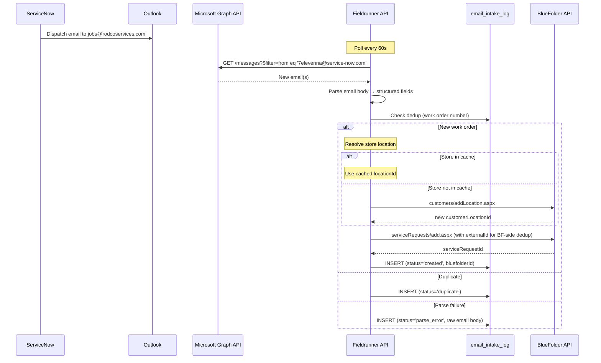
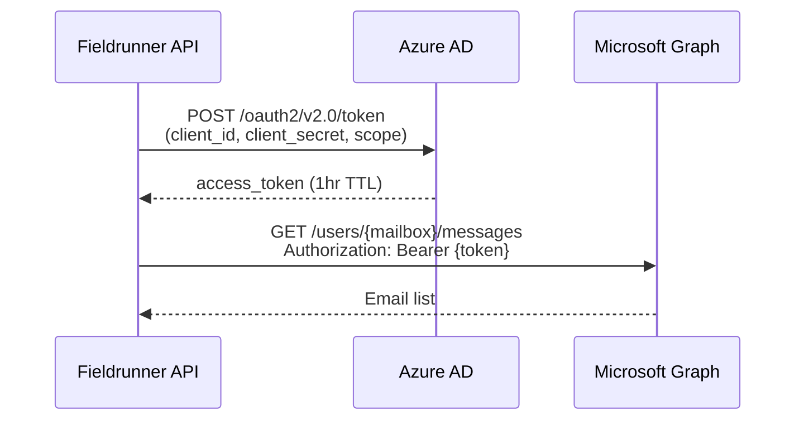
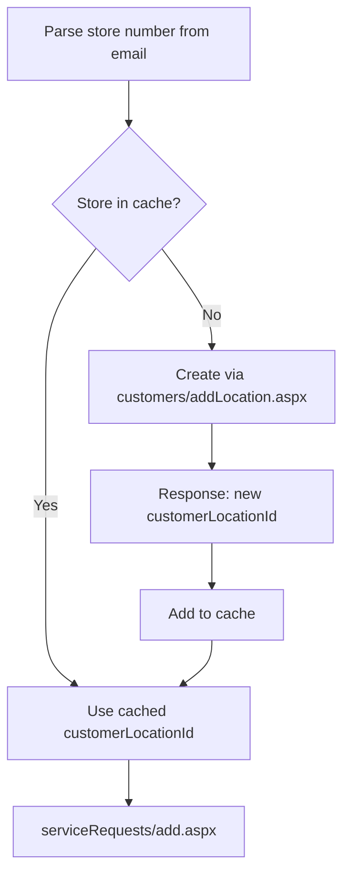

# ServiceNow Email Intake

Automated pipeline that parses 7-Eleven dispatch emails from ServiceNow/Nuvolo and creates BlueFolder service requests — eliminating manual VA data entry and closing the "New → In Progress" timing gap.

## Problem Statement

RodCo's largest client is 7-Eleven, accounting for **66% of all service requests** (791 of ~1,200 SRs). 7-Eleven dispatches work orders through ServiceNow/Nuvolo, which arrive as structured emails to `jobs@rodcoservices.com`. Today, virtual assistants manually read these emails and re-enter the data into BlueFolder.

This creates two problems:

1. **Delayed SR creation.** PMs often start working a job before the VA enters it in BlueFolder, meaning the SR's `dateTimeCreated` reflects when the VA got to it — not when the work was actually dispatched. Event data confirms this: the median "New → In Progress" time is only **1.0 hour**, but that's because SRs are created retroactively after work has already begun.

2. **Data entry errors.** Manual transcription of store numbers, addresses, priority levels, and work order descriptions introduces inconsistencies.

### Evidence from Event Data (Sep 2025 – Mar 2026)

| Metric | Value |
|--------|-------|
| Total SRs analyzed | 1,201 |
| 7-Eleven SRs | 791 (66%) |
| "New" status median dwell | 1.0 hours |
| "New" status p95 dwell | 385.7 hours |
| "New → In Progress" median | 1.4 hours |
| "New → In Progress" p95 | 49.3 hours |

The short median with a massive p95 tail confirms the pattern: most SRs are entered right before (or after) work starts, but outliers sit for days before a VA processes them.

```sql
-- 7-Eleven dominance in SR volume
SELECT customer_name, customer_id, COUNT(*) AS sr_count
FROM service_requests
WHERE organization_id = :orgId
GROUP BY customer_name, customer_id
ORDER BY sr_count DESC
LIMIT 5;

-- Result:
-- Seven Eleven        | 38508963 | 791
-- Cato Corporation    | 38856523 | 309
-- Dick's Sporting Goods | 38913727 | 55
-- Capitol Petroleum   | 38798796 | 45
-- GPM Investments     | 39198564 | 32
```

## Architecture

```mermaid
flowchart LR
    SN[ServiceNow / Nuvolo] -->|dispatch email| OL[Outlook<br>jobs@rodcoservices.com]
    OL -->|Microsoft Graph API| FR[Fieldrunner API<br>EmailIntakeService]
    FR -->|resolve location| BF_LOC[BlueFolder API<br>customers/addLocation.aspx]
    FR -->|create SR| BF_SR[BlueFolder API<br>serviceRequests/add.aspx]
    BF_SR -->|next sync| DB[(service_requests)]
    DB -->|event| EE[EventEmitter<br>sync.completed]
    FR -->|audit log| LOG[(email_intake_log)]
```

**Pipeline:** Emails are polled from the mailbox, parsed, deduplicated, and submitted directly to BlueFolder as "New" SRs. PMs already review incoming "New" SRs as part of their normal workflow — no custom draft queue or approval UI needed.

An `email_intake_log` table tracks every processed email for dedup and debugging.

### End-to-End Sequence



## Email Template Spec

All 5 sample emails use an **identical template**. Sender is always `7elevenna@service-now.com`. The body is plain-text key-value pairs — not HTML — making regex parsing reliable.

### Sample Email

```
From: 7HELP Service Desk <7elevenna@service-now.com>
To: Rodco Jobs <jobs@rodcoservices.com>
Subject: 7-Eleven Priority 1 - Critical Work Order FWKD11021610 / INC23544260
         has been dispatched.

Work Order FWKD11021610 has been submitted with the following details:

Number: FWKD11021610

Incident: INC23544260

Store Location: 7-ELEVEN STORE - 23655

Store Address: 920 BOULEVARD,SEASIDE HEIGHTS,NJ,US,087512128

AFM: Terry Mcgovern

Email: Terry.McGovern@7-11.com

Priority: 1 - Critical

State: Open

Functional Status: Dispatched

Line of Service: EMS

Business Service: EMS

Category: EMS GENERATED ALARM|EMS

Sub Category: NO COMM HVAC-1

Service Provider: Rodco

Order Summary: STORE COMPLAINT: "Store temp is very very cold at night..."

Order Description: STORE COMPLAINT: "Store temp is very very cold..."
REMOTE FINDINGS: -There's no communication with the RTU1...

Ref:MSG631642386_4OR0HeJ7bbArTKhzL6
```

### Field Reference

| Field | Location | Format | Example |
|-------|----------|--------|---------|
| Work Order Number | Subject + Body (`Number:`) | `FWKD\d{8}` | `FWKD11021610` |
| Incident Number | Subject + Body (`Incident:`) | `INC\d{8}` | `INC23544260` |
| Store Name | Body (`Store Location:`) | `{BRAND} STORE - {number}` | `7-ELEVEN STORE - 23655` |
| Store Number | Parsed from Store Location | `\d{4,5}` after ` - ` | `23655` |
| Store Address | Body (`Store Address:`) | `street,city,state,country,zip` | `920 BOULEVARD,SEASIDE HEIGHTS,NJ,US,087512128` |
| AFM Name | Body (`AFM:`) | Free text | `Terry Mcgovern` |
| AFM Email | Body (`Email:`) | Email address | `Terry.McGovern@7-11.com` |
| Priority | Subject + Body (`Priority:`) | `{1\|2\|3\|4} - {label}` | `1 - Critical` |
| State | Body (`State:`) | Always `Open` | `Open` |
| Functional Status | Body (`Functional Status:`) | Always `Dispatched` | `Dispatched` |
| Line of Service | Body (`Line of Service:`) | Free text | `EMS` |
| Business Service | Body (`Business Service:`) | Free text | `EMS` |
| Category | Body (`Category:`) | Free text, may contain `\|` | `EMS GENERATED ALARM\|EMS` |
| Sub Category | Body (`Sub Category:`) | Free text | `NO COMM HVAC-1` |
| Service Provider | Body (`Service Provider:`) | Should always be `Rodco` | `Rodco` |
| Order Summary | Body (`Order Summary:`) | Free text (single line) | `STORE COMPLAINT: "Store temp..."` |
| Order Description | Body (`Order Description:`) | Free text (multi-line, until `Ref:`) | Full description with remote findings |
| Reference ID | Body (`Ref:`) | `MSG\d+_[A-Za-z0-9]+` | `MSG631642386_4OR0HeJ7bbArTKhzL6` |

### Validated Across Samples

| Sample | Work Order | Priority | Service Type | Location | State |
|--------|-----------|----------|-------------|----------|-------|
| 1 | FWKD11021610 | 1 - Critical | EMS / HVAC | 7-ELEVEN STORE - 23655 | NJ |
| 2 | FWKD11015792 | 2 - Emergency | General Maintenance / Front door | 7-ELEVEN STORE - 37091 | NJ |
| 3 | FWKD11037865 | 1 - Critical | Plumbing / Toilet | BCP STORE - 35090 | NY |
| 4 | FWKD11040661 | 1 - Critical | Plumbing / Floor Drain | 7-ELEVEN STORE - 35103 | NY |
| 5 | FWKD11034665 | 1 - Critical | EMS / HVAC / Ducts | 7-ELEVEN STORE - 35033 | NJ |

Template is **consistent across all priority levels, service types, and geographies**. Note that store 35090 uses brand "BCP" instead of "7-ELEVEN" — the store number format is the same.

## Microsoft Graph Integration

RodCo uses **Microsoft 365 / Exchange Online** (confirmed via SMTP headers showing `outbound.protection.outlook.com`). The `jobs@rodcoservices.com` mailbox is the target.

### Polling vs. Subscriptions

| Approach | Latency | Complexity | Reliability |
|----------|---------|------------|-------------|
| **Polling** (recommended) | 30-60s | Low — simple GET calls | High — no webhook infrastructure needed |
| Change Notifications (webhook) | ~seconds | Medium — requires public HTTPS endpoint, subscription renewal every 3 days | Medium — subscriptions expire, need renewal logic |

**Recommendation: Polling.** The 30-60 second delay is negligible for this use case (current manual process takes hours to days). Polling avoids the complexity of managing webhook subscriptions and doesn't require a publicly-accessible endpoint.

### Auth: Client Credentials Flow



**Auth parameters:**
- Grant type: `client_credentials`
- Scope: `https://graph.microsoft.com/.default`
- Permission: `Mail.Read` (Application, not Delegated)
- Token endpoint: `https://login.microsoftonline.com/{tenantId}/oauth2/v2.0/token`

### Polling Implementation

```
GET https://graph.microsoft.com/v1.0/users/jobs@rodcoservices.com/messages
  ?$filter=from/emailAddress/address eq '7elevenna@service-now.com'
           and receivedDateTime ge {lastPollTimestamp}
  &$select=id,subject,body,receivedDateTime,from
  &$orderby=receivedDateTime asc
  &$top=50
```

**Key behaviors:**
- Poll every **60 seconds** via `@Interval(60_000)` (NestJS scheduler)
- Track `lastPollTimestamp` in the database — persists across restarts
- Mark messages as read after processing (optional — `PATCH /messages/{id}` with `isRead: true`)
- Filter server-side by sender address to minimize data transfer

### Mailbox Scoping (Optional)

For security-conscious orgs, an Exchange admin can restrict the app to only access `jobs@rodcoservices.com`:

```powershell
# Run in Exchange Online PowerShell
New-ApplicationAccessPolicy `
  -AppId "<client-id>" `
  -PolicyScopeGroupId "jobs@rodcoservices.com" `
  -AccessRight RestrictAccess `
  -Description "Fieldrunner can only read jobs mailbox"
```

This is optional for a small company like RodCo — the `Mail.Read` permission alone is sufficient, and the app only queries the `jobs@` mailbox by design.

## Parser Spec

The email body is plain-text key-value pairs. Parsing is straightforward regex extraction.

### Regex Patterns

```typescript
const PATTERNS = {
  // Subject line parsing
  workOrderNumber: /Work Order (FWKD\d{8})/,
  incidentFromSubject: /\/ (INC\d{8})/,

  // Body field extraction (each captures after the label)
  number:           /^Number:\s*(.+)$/m,
  incident:         /^Incident:\s*(.+)$/m,
  storeLocation:    /^Store Location:\s*(.+)$/m,
  storeAddress:     /^Store Address:\s*(.+)$/m,
  afm:              /^AFM:\s*(.+)$/m,
  afmEmail:         /^Email:\s*(.+)$/m,
  priority:         /^Priority:\s*(.+)$/m,
  state:            /^State:\s*(.+)$/m,
  functionalStatus: /^Functional Status:\s*(.+)$/m,
  lineOfService:    /^Line of Service:\s*(.+)$/m,
  businessService:  /^Business Service:\s*(.+)$/m,
  category:         /^Category:\s*(.+)$/m,
  subCategory:      /^Sub Category:\s*(.+)$/m,
  serviceProvider:  /^Service Provider:\s*(.+)$/m,
  orderSummary:     /^Order Summary:\s*(.+)$/m,
  referenceId:      /^Ref:(MSG\S+)$/m,

  // Store number from location string
  storeNumber:      /- (\d{4,5})$/,

  // Multi-line: Order Description runs until Ref: line
  orderDescription: /^Order Description:\s*([\s\S]*?)(?=\n\s*\nRef:|Ref:MSG)/m,
};
```

### Deduplication

**Two layers of dedup:**

1. **Fieldrunner-side:** Check `email_intake_log` before calling BlueFolder.

```sql
SELECT id FROM email_intake_log
WHERE work_order_number = :workOrderNumber
  AND organization_id = :orgId
  AND status = 'created';
```

If a match exists, log as `duplicate` and skip.

2. **BlueFolder-side:** The `externalId` field on the SR is set to the work order number. BF enforces uniqueness — if the same `externalId` is submitted twice, the API returns an error. This is defense-in-depth against race conditions or log corruption.

### Validation Rules

| Check | Action on Failure |
|-------|-------------------|
| `Service Provider` is not `Rodco` | Skip — not our work order |
| Work order number missing | Log as `parse_error`, store raw email body for debugging |
| Any required field missing | Still create SR with available fields, log warnings |

## BlueFolder SR Creation

Parsed emails are submitted directly to BlueFolder via `serviceRequests/add.aspx`. The SR is created in "New" status — PMs review incoming "New" SRs as part of their normal workflow.

### API Call

```
POST https://app.bluefolder.com/api/2.0/serviceRequests/add.aspx
Authorization: Basic <Base64(apiKey:X)>
Content-Type: application/xml
```

### Field Mapping: Email → BlueFolder

| Email Field | BlueFolder XML Field | Limit | Transform |
|-------------|---------------------|-------|-----------|
| Work Order Number | `externalId` | unique | `FWKD11021610` — BF enforces uniqueness, gives us server-side dedup |
| Work Order Number | `referenceNo` | 50 chars | Direct (`FWKD11021610`) |
| Work Order Number | `sourceId` | 50 chars | Same as `referenceNo` |
| `"ServiceNow"` | `sourceName` | 50 chars | Static value |
| Priority | `priority` | 50 chars | String, pass as-is: `"1 - Critical"` |
| Line of Service | `type` | 50 chars | Direct: `"EMS"`, `"Plumbing - General"`, etc. |
| Order Summary | `description` | **100 chars** | Truncated: `"{LineOfService}: {OrderSummary}"` (see note) |
| Order Description + metadata | `detailedDescription` | no limit | Full description + appended metadata block (see below) |
| Store Number | `customerLocationId` | numeric | Lookup or create (see Store Location Resolution) |
| `false` | `notifyCustomer` | boolean | Prevent BF from emailing the 7-Eleven contact |

**`description` 100-char limit:** BlueFolder's `description` field is capped at 100 characters. The full category/subcategory/summary often exceeds this. Strategy: use `"{LineOfService}: {OrderSummary}"` truncated to 100 chars. The full category, subcategory, and untruncated summary are preserved in `detailedDescription`.

### Store Location Resolution

Every email contains the store name and full address (already paired by 7-Eleven on their side). BlueFolder requires a numeric `customerLocationId` on the SR — and provides both a **Customer Locations API** for creating locations and a **Customers API** (`customers/get.aspx`) that returns all existing locations for a customer.

**Resolution flow:**



1. Parse store number from `Store Location` (e.g., `23655` from `7-ELEVEN STORE - 23655`)
2. Parse address components from `Store Address` (comma-separated: `street,city,state,country,zip`)
3. Look up `customerLocationId` in the in-memory cache
4. **If found:** Use the existing `customerLocationId`
5. **If not found:** Create the location via `customers/addLocation.aspx`, cache the returned ID

Every email can be fully resolved — no unresolved locations, no PM manual fixup needed.

#### Building the Location Cache

Call `customers/get.aspx` with 7-Eleven's customer ID. The response includes **all locations inline**:

```
POST https://app.bluefolder.com/api/2.0/customers/get.aspx
```

```xml
<request>
  <customerId>38508963</customerId>
</request>
```

Response (truncated):

```xml
<response status="ok">
  <customer>
    <customerId>38508963</customerId>
    <customerName>Seven Eleven</customerName>
    <locations>
      <location>
        <locationId>12345</locationId>
        <locationName>7-ELEVEN STORE - 23655</locationName>
        <addressStreet>920 BOULEVARD</addressStreet>
        <addressCity>SEASIDE HEIGHTS</addressCity>
        <addressState>NJ</addressState>
        <addressPostalCode>08751</addressPostalCode>
      </location>
      <location>
        <locationId>12346</locationId>
        <locationName>7-ELEVEN STORE - 35033</locationName>
        <!-- ... -->
      </location>
      <!-- all locations -->
    </locations>
  </customer>
</response>
```

Parse each `<location>` to build `Map<string, number>` (store number → `locationId`). Refresh on startup and periodically (e.g., daily). One API call gives us the complete mapping.

#### Creating a New Location

When a store number isn't in the cache:

```
POST https://app.bluefolder.com/api/2.0/customers/addLocation.aspx
```

```xml
<request>
  <customerLocationAdd>
    <customerId>38508963</customerId>
    <locationName>7-ELEVEN STORE - 23655</locationName>
    <addressStreet>920 BOULEVARD</addressStreet>
    <addressCity>SEASIDE HEIGHTS</addressCity>
    <addressState>NJ</addressState>
    <addressCountry>US</addressCountry>
    <addressPostalCode>08751</addressPostalCode>
  </customerLocationAdd>
</request>
```

Response returns the new `customerLocationId`. Add it to the cache immediately.

**BF field limits for locations:**

| Field | Limit | Example |
|-------|-------|---------|
| `locationName` | 50 chars | `7-ELEVEN STORE - 23655` (23 chars) |
| `addressStreet` | 250 chars | `920 BOULEVARD` |
| `addressCity` | 25 chars | `SEASIDE HEIGHTS` (15 chars) |
| `addressState` | 25 chars | `NJ` |
| `addressCountry` | 25 chars | `US` |
| `addressPostalCode` | 10 chars | `08751` |

#### Address Parsing

The `Store Address` field is comma-separated: `street,city,state,country,zip`.

```typescript
// "920 BOULEVARD,SEASIDE HEIGHTS,NJ,US,087512128"
const [street, city, state, country, rawZip] = storeAddress.split(',').map(s => s.trim());
const zip = rawZip.substring(0, 5); // Normalize ZIP+4 (087512128 → 08751)
```

**Zip code note:** Some zips include the ZIP+4 without a hyphen (e.g., `087512128` = `08751-2128`). Normalizing to 5-digit avoids creating duplicate locations for the same store.

### BlueFolder Customer Reference

7-Eleven in BlueFolder: `customerId: 38508963`.

### Request XML

```xml
<request>
  <serviceRequestAdd>
    <customerId>38508963</customerId>
    <customerLocationId>{resolved_location_id}</customerLocationId>
    <externalId>FWKD11021610</externalId>
    <description>EMS: STORE COMPLAINT: "Store temp is very very cold at night customers and employees</description>
    <detailedDescription>STORE COMPLAINT: "Store temp is very very cold at night customers and employees are complaining. Very cold."

REMOTE FINDINGS: -There's no communication with the RTU1 (IO/flex board), so all operations are unknown. Please make sure the unit is mechanically sound, then work with TUTENLABS to restore comms.

*An EMS specialist tech is required to perform this task, someone familiar enough with the subject and the ALC controller boards.*

TECHNICIANS: Please contact Tutenlabs (855-298-7617) while on site to verify unit operation and validate store conditions align with EMS readings and controls.

---
ServiceNow Work Order: FWKD11021610
Incident: INC23544260
Store: 7-ELEVEN STORE - 23655
Address: 920 BOULEVARD, SEASIDE HEIGHTS, NJ, US, 08751
AFM: Terry Mcgovern (Terry.McGovern@7-11.com)
Priority: 1 - Critical
Category: EMS GENERATED ALARM|EMS / NO COMM HVAC-1
    </detailedDescription>
    <priority>1 - Critical</priority>
    <type>EMS</type>
    <referenceNo>FWKD11021610</referenceNo>
    <notifyCustomer>false</notifyCustomer>
    <sourceName>ServiceNow</sourceName>
    <sourceId>FWKD11021610</sourceId>
  </serviceRequestAdd>
</request>
```

**Key details:**
- `externalId` set to the work order number — BF enforces uniqueness, so duplicate submissions are rejected at the API level (defense-in-depth on top of our `email_intake_log` dedup)
- `description` truncated to 100 chars (`"{LineOfService}: {OrderSummary}"`)
- `detailedDescription` contains the full untruncated order description plus a metadata block (after `---`) with all ServiceNow fields for reference
- `notifyCustomer` set to `false` to prevent BF from emailing the 7-Eleven contact
- `priority` passed as the full string from the email (BF accepts any string up to 50 chars)

## Intake Log

A lightweight log table tracks every processed email for dedup and debugging. No approval workflow — just an audit trail.

### Schema

| Column | Type | Nullable | Default | Notes |
|--------|------|----------|---------|-------|
| `id` | uuid | no | `gen_random_uuid()` | PK |
| `organization_id` | uuid FK | no | — | Org scoping |
| `status` | text | no | — | `created`, `duplicate`, `parse_error`, `skipped` |
| `work_order_number` | text | yes | — | `FWKD\d{8}`, null if parse failed |
| `incident_number` | text | yes | — | `INC\d{8}` |
| `store_number` | text | yes | — | Parsed from Store Location |
| `store_address` | text | yes | — | Raw address from email |
| `priority` | text | yes | — | e.g. `1 - Critical` |
| `line_of_service` | text | yes | — | e.g. `EMS` |
| `category` | text | yes | — | e.g. `EMS GENERATED ALARM\|EMS` |
| `order_summary` | text | yes | — | Short description |
| `bluefolder_id` | integer | yes | — | Set after BF creation |
| `customer_location_created` | boolean | no | `false` | Whether a new BF location was created |
| `graph_message_id` | text | yes | — | Microsoft Graph message ID |
| `raw_email_subject` | text | yes | — | For debugging |
| `raw_email_body` | text | yes | — | For debugging (parse errors) |
| `error_message` | text | yes | — | Parse error details |
| `created_at` | timestamptz | no | `now()` | — |

**Unique constraint:** `uq_intake_log_wo` on `(organization_id, work_order_number)` — prevents duplicate processing.

## Phased Rollout

### Phase 1: Monitoring

- Pipeline runs, creates SRs directly in BlueFolder as "New"
- PMs review in BlueFolder as normal — no new UI needed
- Team monitors `email_intake_log` for parse errors or unexpected data
- New store locations are auto-created in BlueFolder via `customers/addLocation.aspx`

### Phase 2: Expand to Other Clients

- Once validated with 7-Eleven, add parser templates for other clients (Cato Corporation, etc.)
- Pluggable parser architecture: one parser per email template format

## Setup Requirements

### Azure AD App Registration (for RodCo IT)

A one-time setup requiring Microsoft 365 admin access. Estimated time: 10-15 minutes.

**Steps:**

1. Go to [portal.azure.com](https://portal.azure.com) → sign in with admin account
2. Search for **"App registrations"** → click **"New registration"**
   - Name: `Fieldrunner Email Integration`
   - Leave defaults → **Register**
3. On the overview page, copy:
   - **Application (client) ID**
   - **Directory (tenant) ID**
4. Left sidebar → **Certificates & secrets** → **New client secret**
   - Description: `fieldrunner`
   - Expiration: 24 months
   - **Copy the Value immediately** (it won't show again)
5. Left sidebar → **API permissions** → **Add a permission**
   - **Microsoft Graph** → **Application permissions**
   - Search and check **`Mail.Read`**
   - Click **Add permissions**
   - Click **Grant admin consent**

**Send these 3 values to the Fieldrunner team:**
- Application (client) ID
- Directory (tenant) ID
- Client secret value

### Fieldrunner Environment Variables

```bash
# Microsoft Graph (email polling)
GRAPH_TENANT_ID=<from step 3>
GRAPH_CLIENT_ID=<from step 3>
GRAPH_CLIENT_SECRET=<from step 4>
GRAPH_MAILBOX=jobs@rodcoservices.com

# Polling interval (optional, default 60000ms)
EMAIL_POLL_INTERVAL_MS=60000
```

### Module Structure

```
apps/api/src/integrations/email-intake/
├── email-intake.module.ts
├── email-intake.service.ts           # Polling loop, dedup, BF creation
├── graph-mail.service.ts             # Microsoft Graph API client
├── email-parser.service.ts           # Regex parser for ServiceNow emails
├── types/
│   └── email-intake.types.ts
└── __tests__/
    ├── email-parser.service.spec.ts  # Parser unit tests with all 5 sample emails
    └── email-intake.service.spec.ts
```

## Future Considerations

- **Bidirectional sync.** Push status updates back to ServiceNow when an SR progresses in BlueFolder (e.g., "In Progress", "Work Complete"). Would require 7-Eleven to grant inbound API access or accept email-based status updates.
- **Status updates via email reply.** ServiceNow threads on `Ref:MSG...` — replying to the dispatch email with a structured status update may automatically update the work order.
- **Other clients.** Cato Corporation (26% of SRs) and other clients may have their own dispatch systems. The parser architecture should support pluggable email templates.
- **Attachment forwarding.** Some dispatch emails may include attachments (photos, scopes of work). The pipeline should forward these to BlueFolder via `serviceRequests/addFile.aspx`.
- **SLA monitoring.** With accurate `dateTimeCreated` (from email `receivedDateTime` instead of VA entry time), the event system can measure true response times and flag SLA breaches.
- **Nuvolo vendor portal.** 7-Eleven may offer vendor portal access for direct API integration, bypassing email entirely. Worth revisiting if the relationship deepens.
- **Multi-tenant.** The current design scopes everything by `organization_id`. If other RodCo orgs (or other Fieldrunner customers) need email intake, the same pipeline works with per-org Graph credentials.
